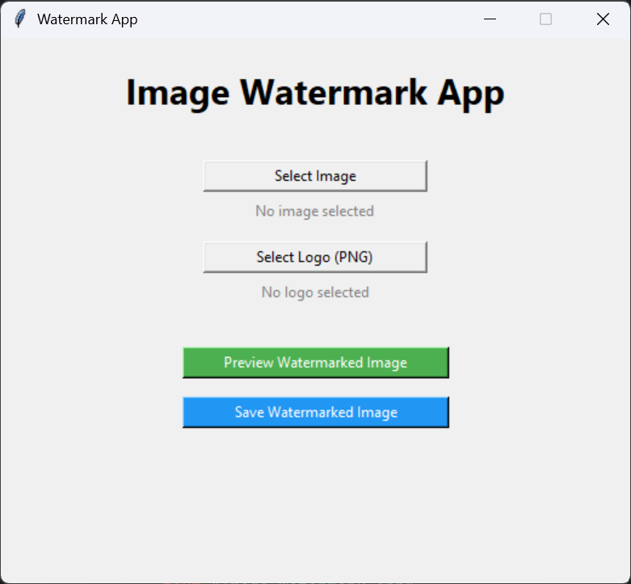
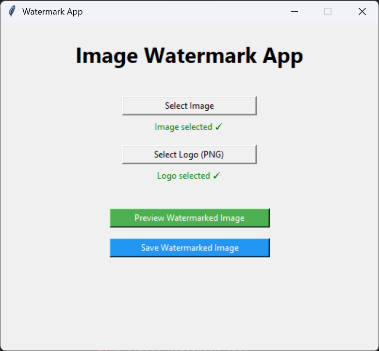
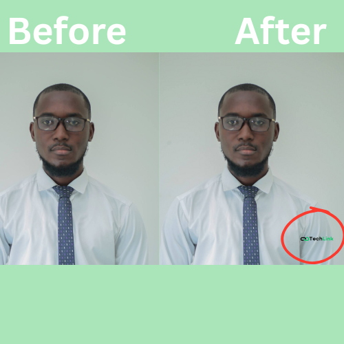

**Image Watermark App**

A simple Python GUI application to add a watermark logo to your images using Tkinter and Pillow (PIL).
Supports JPG, JPEG, PNG for images and PNG logos with transparency.

**Features**
• Select any image (JPG, JPEG, PNG)  
• Select a transparent PNG logo as a watermark
• Automatically resizes logo (max 25% of image width)
• Places watermark at bottom-right corner by default
• Preview watermarked image before saving
• Save result as PNG or JPG
• Automatically handles transparency for JPG/PNG

**Screenshot**
### Main Interface

### Preview Window

### Before & After Img

## 🚀 Installation

1. Clone the repository:

git clone https://github.com/BenjaminTutu/watermark-app.git

cd watermark-app

2. Create a virtual environment (optional but recommended):
python -m venv venv
source venv/bin/activate
→ for Linux/macOS
venv\Scripts\activate
→ for Windows

4. Install dependencies:
pip install pillow

**Usage**
Run the app with:
python watermark-app.py

• Click Select Image → choose the main image.
• Click Select Logo (PNG) → choose a transparent PNG logo.
• Click Preview Watermarked Image to see the result.
• Click Save Watermarked Image to save it as PNG or JPG.

**Code Structure**

WatermarkApp class handles:
  • UI creation (create_ui())
  • Image & logo selection (select_image(), select_logo())
  • Watermark processing (show_watermark())
  • Preview (show_image())
  • Saving the image (save_image())

**Supported File Types**

  • Background images: JPG, JPEG, PNG
  • Logo: PNG only (must support transparency)

**Notes / Tips**

The logo is automatically resized to 25% of the image width for a consistent appearance.
For large images, the preview is scaled to fit the screen.
JPG files do not support transparency; the program converts RGBA → RGB automatically.
You can customize:
  - Watermark position (bottom-right by default)
  - Logo opacity (requires code modification)

**Future Improvements**

• Add position options (top-left, center, bottom-left)
• Add an opacity slider to make the watermark semi-transparent
• Batch watermark multiple images at once
